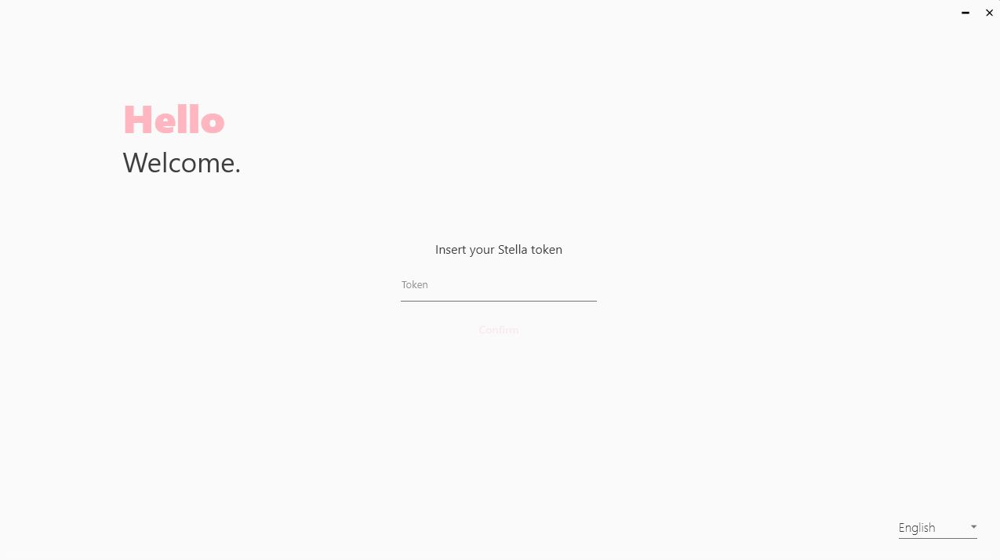
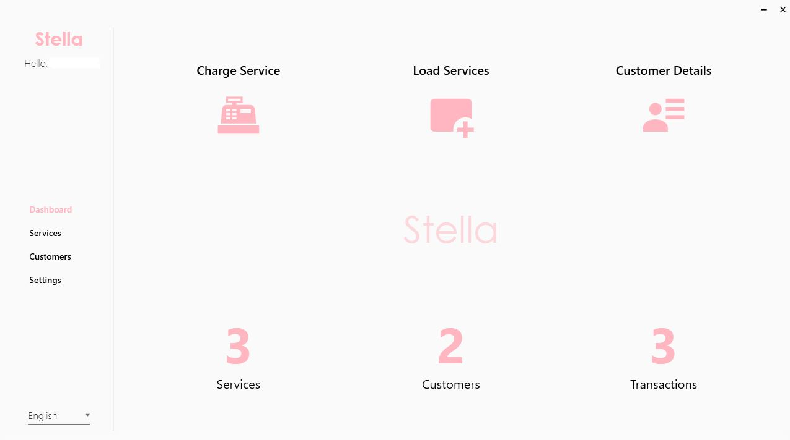

# Stella

## What is Stella?

Stella is a simple customer management for small businesses. The idea came from the necessity by a specific store to manage its customers in a simple way, giving up on the hundreds of papers and archives that were at the store.

It is currently available in English and Portuguese.

## How to use?

To start using Stella, you may request me a free token, to insert in the authentication window.

Once you have your application, you can start adding customers and services, loading their accounts with pre-paid services and charge them, or do a one-time purchase during the charging process.

The idea of loading services is for the customers to be able to load RFID business cards with pre-paid services and redeem them at the store.

The RFID card reader is supposed to be cheap for small businesses. Since the price of one of these equipments is usually around 30-50$, I developed a cheap alternative with arduino which would cost only around 5$.

The code and details of this equipment are on the [stella-reader](stella-reader) folder.

## TODO

- WooCommerce plugin for purchasing services online (and redeem at the store)
